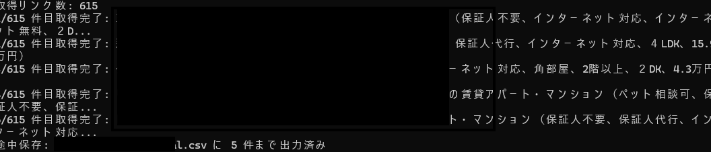
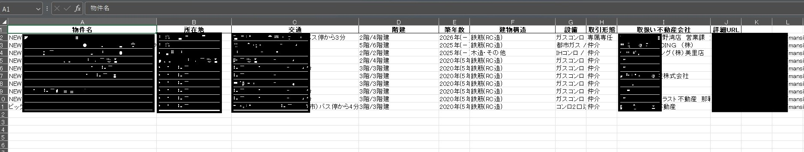

# bukken_scraper
不動産サイトの各物件情報を抽出する

# はじめに
PythonのSeleniumを使用してスクレイピングしたデータをExcelに書き出せるか確認してみました。
より実用的な内容の不動産の物件情報を抽出項目ごとに抜き出し、Excelに記載する形で作成。

# 使用技術など
言語：Python
・Selenium：ブラウザの自動操作  
・Pandas：Excelへのデータの書き出し  
・ChatGPT：詰まった箇所や書き方の確認  
・Google chrome：今回使用したブラウザ  

# 実行イメージ
※念のため、今回使用した不動産サイトの情報は黒塗りにしております。

実際の不動産物件出力画面  

無事にExcelに書き出すことができました。

# 参考リンクなど
学習しての課題や問題点などは[Qiitaの記事](https://qiita.com/dorayaki800/private/1ad7a89abc33aad5549e)に書きました。

